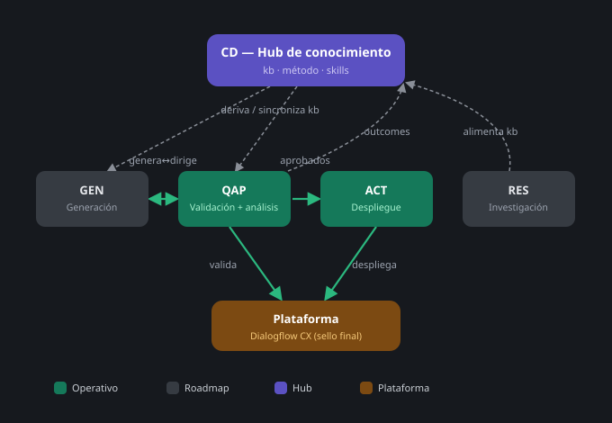
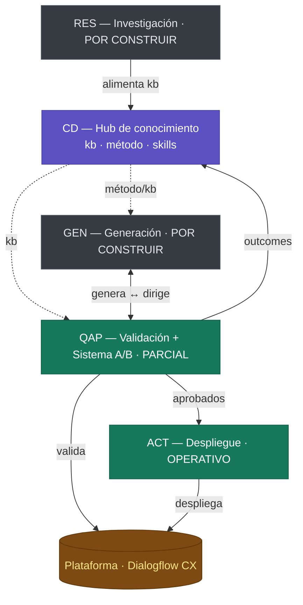

# SISTEMA — Visión y mapa de arquitectura

> **Documento de visión del sistema de Automatización CD (Conversational Design).**
> Estado: BORRADOR · Fecha: 2026-06-15 · Autor: Jerónimo Sánchez
>
> Distingue lo que está **construido y operativo** hoy de lo que es **roadmap**.

---

## 1. Qué es este sistema

Un sistema para **diseñar, desplegar y validar agentes conversacionales** de calidad
production-grade, de forma automatizada y **con vocación agnóstica de plataforma**.

El caso piloto es **Petal**, un agente de comercio de flores en español construido sobre
Dialogflow CX, tratado como una simulación profesional (estructura, procesos y calidad de
un proyecto real en producción). Desde el inicio está **enfocado a no depender de Petal ni de CX**:
el diseño separa un **núcleo** (el método de validación/optimización) de un **adapter** por plataforma.
Pero el agnosticismo es **evolutivo** — se gana a medida que se construyen las líneas y se prueba el
sistema contra otros agentes y plataformas (Lex, Voiceflow, custom), no se da por hecho. Hoy **se está
validando sobre CX**; la transferencia a otras plataformas es **objetivo de diseño, aún por demostrar**.

El sistema se organiza en **4 líneas de automatización** (ACT, GEN, QAP, RES) coordinadas alrededor de
un **hub de conocimiento y método (CD)** que actúa como cerebro y fuente única de verdad.

---

## 2. Mapa de conjunto



<details>
<summary>Fuente editable (Mermaid)</summary>



</details>

El sistema se alinea con las **5 fases del ciclo de vida** de un agente (DESIGN · BUILD · VALIDATE ·
ITERATE · STRATEGIC) y **se adapta a dos escenarios de entrada**, cada uno con su forma:

**① Greenfield** — agente nuevo, de cero (recorrido **lineal**):

```
DESIGN  ──→  BUILD       ──→  VALIDATE  ──→  producción
(CD)         (GEN + ACT)      (QAP)
```

**② Optimización** — agente ya en producción con FAILs (**bucle**, Sistema A):

```
       agente en producción
             │
             ▼
  VALIDATE  ──→  DIAGNOSTICA  ──→  REPARA      ──→  VALIDA
  (QAP)                            (GEN + ACT)        │
     ▲              no resuelto ◀────────────────────┘
     └─ resuelto → aprende (Sistema B → CD/kb)
```

Misma maquinaria (las 4 líneas + CD); **dos recorridos**.

---

## 3. Las 4 líneas + CD

### CD — Hub de conocimiento y método  ·  ESTADO: existe (en construcción activa)

El "cerebro" del sistema. No despliega ni valida nada por sí mismo: **gobierna el conocimiento,
el método y las skills** que el resto de líneas consumen.

Contenido real (carpeta `~/CD/`):

- **`kb/`** — la *knowledge base*, fuente única de verdad. Organizada en 4 capas con nomenclatura
  propia y gobierno (`_index.md`, `_politica_kb.md`, `_nomenclatura_kbs.md`):
  - `kb_ag_*` — agnóstico: principios de diseño conversacional **y el método** (los pasos de diseño / greenfield), IP del método.
  - `kb_sys_*` — el motor (arquitectura del ciclo, roles de cada skill, costes, modelo de madurez).
  - `kb_plat_*` — adapter por plataforma (quirks de Dialogflow CX, runtime ADK local).
  - `kb_proj_*` — específico del cliente activo (estado de Petal).
  - Cada KB lleva estado explícito (🔴 no existe · 🟡 en curso · ✅ validado). Hoy varios `kb_ag_*`
    y de proyecto están aún por construir — el `_index.md` lo refleja con honestidad.
- **`metodologia/`** — los **pasos y templates del ciclo de vida** (briefing, análisis de query,
  asignación NLU/LLM, derivación de arquitectura, framework QAP) + `system_inventory.md`. Es
  **conocimiento agnóstico** → conceptualmente pertenece a `kb_ag`; hoy en carpeta aparte,
  **consolidación en la kb pendiente**.
- **`skills/`** — registro de las skills del sistema (`_index.md`), con su línea (ACT/GEN/QAP),
  modelo asignado y estado. La mayoría están aún en estado 🔴/🟡 (definición o validación pendiente).

> **Honestidad sobre CD:** CD es sobre todo **método y conocimiento documentado**, no código que
> corra. Su valor de portfolio es mostrar que el sistema parte de un diseño explícito y gobernado,
> no de improvisación. Una parte sustancial de los KBs y skills registrados están todavía en
> roadmap; el `_index.md` de cada registro es la fuente honesta de qué existe y qué no.

### ACT — Despliegue de artefactos  ·  ESTADO: ✅ construido y operativo

- **Repo:** `cx-automation-template` — https://github.com/jeronimosanchez/cx-automation-template
- **Local:** `~/cx-automation-template/`
- **Qué hace:** despliega los 12 tipos de artefacto de un agente CX (Playbooks, Examples, Tools,
  Agent Config, Flows, Pages, Intents, Entity Types, Webhooks, Generators, Environments, Versions)
  desde definiciones versionadas en git hacia Dialogflow CX.
- **Cómo:** pipeline **idempotente `LIST → diff → PATCH/POST solo lo que cambió`**; nunca recrea
  recursos. CI/CD en GitHub Actions con autenticación **WIF (Workload Identity Federation)** — sin
  claves de service account. El único camino a producción es `git push → CI/CD`.
- **Madurez:** migración real de Petal completada (round-trip-clean validado contra CX), CI/CD verde,
  con detalles de plataforma resueltos y documentados (LRO polling en versions, Full Update por el
  bug regional de Playbooks en `europe-west1`, etc.).

### QAP — Validación de agentes  ·  ESTADO: 🟡 v1.0 (validación) operativo · v1.1 (Sistema A/B) en construcción

- **Repo:** `agent-validation-engine` — https://github.com/jeronimosanchez/agent-validation-engine
- **Local:** `~/agent-validation-engine/`
- **Qué hace:** **método + motor para validar** un agente conversacional, en tres planos:
  1. **Auditoría estática** — analiza el diseño (YAML de playbooks) sin ejecutar el agente.
  2. **Suite QA dinámica** — ejecuta casos de test contra la **plataforma real** y puntúa el comportamiento.
  3. **Cribador local $0** — un proxy local (ADK + modelo local) que propone y criba hipótesis
     gratis antes de gastar llamadas caras contra la plataforma (modelo de embudo:
     *local propone y criba gratis · la plataforma confirma y decide*).
- **Agnóstico:** el razonamiento de validación es portable; lo específico de CX vive en el adapter.
- **Madurez:** repo propio, CI en verde. Lo anterior es **v1.0 (validación), operativo**.
- **v1.1 (en construcción):** QAP 1.1 = **Sistema A** (optimización: diagnostica → repara → valida)
  + **Sistema B** (capitalización del conocimiento). Sistema A diseñado y parcialmente operativo;
  Sistema B por construir. Detalle en `docs/sistema_a/`.

### GEN — Generación de artefactos  ·  ESTADO: por construir (diseñado)

- **Qué hará:** generar playbooks, examples e intents con un patrón adversarial
  **generate → filter → validate** (un modelo genera variantes, otro filtra las mejores, la
  plataforma valida). El objetivo es producir candidatos de calidad a bajo coste y pasarlos a QAP
  para validación antes del gate humano.
- **Estado:** repo `GEN/` + skills y método (generate → filter → validate) diseñados en
  `~/CD/skills/_index.md`, **sin implementación aún**. Su skill `gen_plat_cx_hypothesis_fixer`
  la consume Sistema A·REPARA.

### RES — Investigación en background  ·  ESTADO: por construir

- **Qué hará:** investigación continua que alimenta la `kb` — un cron (p.ej. mensual) que busca y
  destila documentación de plataformas y patrones nuevos, y propone actualizaciones de conocimiento.
- **Estado:** por construir. Alimenta la `kb` con investigación. RES es **fuente** de conocimiento,
  no un KB en sí mismo.

---

## 4. Cómo se relacionan

1. **CD gobierna; las líneas ejecutan.** El método, la `kb` y el registro de skills viven en CD.
   Las **4 líneas — ACT (despliegue), QAP (validación), GEN (generación), RES (investigación)** —
   son los brazos operativos que consumen ese conocimiento.
2. **GEN ↔ QAP (genera ↔ dirige) → QAP aprueba → ACT despliega → outcomes vuelven a CD.** GEN es el
   motor generativo: puede correr **solo** (genera propuestas/optimizaciones de forma proactiva) o
   **servir a QAP** (genera candidatos que QAP valida). QAP **analiza, valida y decide** qué se aprueba
   para desplegar — y puede **dirigir** a GEN pasándole su análisis como brief. Lo que QAP descubre se
   destila de vuelta a la `kb`, mejorando las siguientes iteraciones. (Frontera: generación = GEN;
   juicio/orquestación = QAP.)
3. **RES corre en segundo plano** alimentando la `kb` con investigación, sin bloquear el ciclo.
4. **La plataforma (CX hoy) es el sello final.** Ni el cribador local ni la auditoría estática
   sustituyen la validación contra la plataforma real: proponen y abaratan, pero la plataforma decide.
5. **El trabajo entra por dos sitios.** ① *Greenfield* (agente nuevo) → **GEN**. ② *Optimización*
   (un agente con FAILs) → **QAP**. En optimización, QAP dispara **Sistema A** (diagnostica → repara →
   valida), consumiendo **GEN** (generar parches) y **ACT** (desplegar).

---

## 5. Principio rector: la kb vive en CD

> **La knowledge base es propiedad de CD y es la fuente única de verdad del sistema entero.**

- Los **consumidores** (QAP hoy; GEN/RES mañana) **derivan o sincronizan** la `kb` desde CD y
  **commitean el resultado** dentro de su propio repo. Así cada repo corre **standalone**: clonarlo
  y ejecutarlo no exige tener CD presente.
- **Nunca se hardcodean rutas tipo `~/CD`** en el código de los repos consumidores. La dependencia
  con CD es de *sincronización* (un paso explícito que copia el conocimiento al repo), no de
  *runtime* (el repo no lee de `~/CD` al ejecutar).
- Consecuencia de diseño: CD puede evolucionar y reorganizarse sin romper a los consumidores, y
  cada consumidor mantiene una copia versionada y trazable del conocimiento con el que opera.

Esto refleja una decisión deliberada: separar **el conocimiento (durable, una sola copia maestra)**
de **su uso (distribuido, versionado por repo)**, evitando tanto la duplicación descontrolada como
el acoplamiento frágil a una máquina concreta.

---

## 6. Estado del sistema de un vistazo

| Línea / capa | Repo / ubicación | Rol | Estado |
|---|---|---|---|
| **CD** | `~/CD/` | Hub: kb + método + skills (cerebro) | Existe · en construcción activa |
| **ACT** | `cx-automation-template` | Despliegue idempotente a la plataforma + CI/CD | ✅ Operativo |
| **QAP** | `agent-validation-engine` | v1.0 Validación (estática + dinámica + cribador $0) · v1.1 Sistema A/B | 🟡 **v1.0 construido** · **v1.1 (Sistema A/B) en construcción** |
| **GEN** | `GEN/` | Generación de artefactos (adversarial) | Por construir (diseñado) |
| **RES** | `RES/` | Investigación en background → kb | Por construir |

**Leyenda:** ✅ construido y operativo · 🟡 parcialmente construido · por construir (diseñado, no implementado).

---

## 7. Qué demuestra este sistema (lectura de portfolio)

- **Ingeniería de despliegue real:** un pipeline idempotente con CI/CD y autenticación federada
  (WIF, sin claves), validado contra una plataforma cloud real (ACT).
- **Cultura de calidad:** un motor de validación con auditoría estática, pruebas dinámicas contra la
  plataforma y un cribador local de coste cero, pensado como embudo de coste (QAP).
- **Pensamiento de sistema:** un diseño explícito y gobernado (CD) — knowledge base por capas,
  método documentado, registro de skills con estados honestos — en lugar de scripts sueltos.
- **Agnosticismo deliberado:** separación núcleo/adapter para no quedar atado a una plataforma.
- **Honestidad de alcance:** buena parte del sistema (GEN, RES, el Sistema A/B de QAP, y gran parte
  de la kb y las skills) está **por construir**, no presentada como hecha.

---

*Borrador para revisión. No refleja necesariamente la organización final de carpetas ni la
nomenclatura definitiva; el detalle vivo y autoritativo de cada componente está en los `_index.md`
de `~/CD/kb/` y `~/CD/skills/` y en `~/CD/metodologia/system_inventory.md`.*
